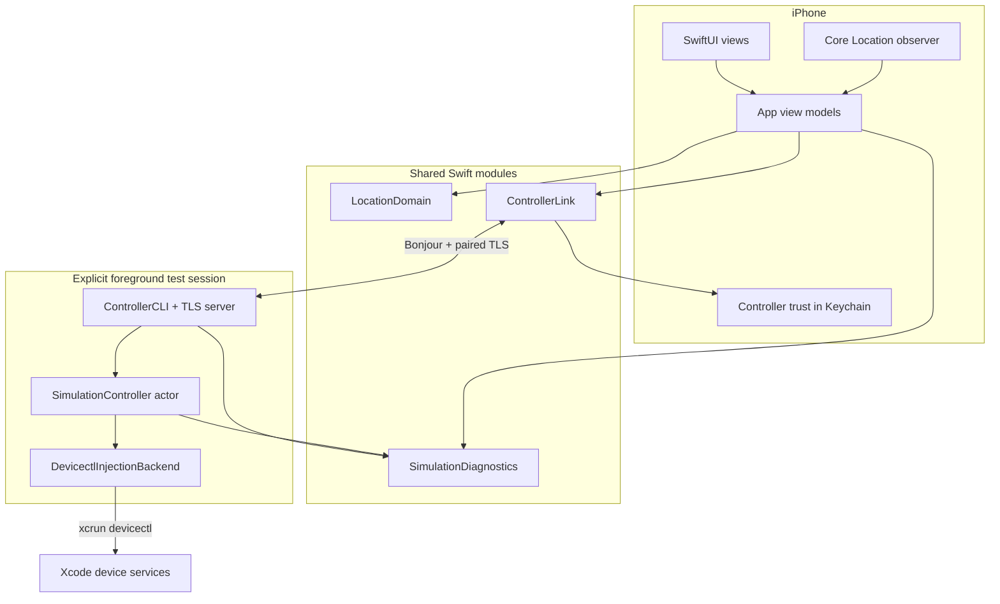

# Pinshift 代码库导览

本导览对应 **v1.1.0**。这份文档说明系统边界、一次 Apply/Clear 的路径和推荐阅读顺序。领域术语以
[CONTEXT.md](CONTEXT.md) 为准，用户流程见 [GUIDE.md](GUIDE.md)。

## 一眼看懂系统



iOS 负责选择、短暂交互状态和观测；手动启动的 Mac 测试会话负责当次会话内的状态、命令串行化和自动解除；
backend 只负责调用 Apple 的位置测试接口。没有 Guardian 或 LaunchAgent；新显式会话以真实 Clear 处理可能的遗留模拟。

## 目录与模块

| 路径 | 职责 | 建议入口 |
| --- | --- | --- |
| `App/` | SwiftUI、App 状态编排、地图搜索、位置观测、收藏和诊断导出 | `ContentView.swift`、`BaselineViewModel.swift` |
| `Sources/LocationDomain/` | 坐标、选择、收藏、观测匹配和 App 侧临时会话投影 | `LocationDomain.swift`、`ManualSimulationSession.swift` |
| `Sources/ControllerLink/` | Bonjour、TLS、配对、Keychain 信任和 Status/Apply/Clear 协议 | `ControllerCommand.swift`、`TrustedControllerLink.swift` |
| `Sources/SimulationController/` | 会话内 authority actor、固定截止时间、真实 Clear 和 `devicectl` backend | `SimulationController.swift` |
| `Sources/SimulationDiagnostics/` | 双端结构化事件、滚动保留、脱敏和导出 | `SimulationDiagnostics.swift` |
| `Sources/ControllerCLI/` | CLI、依赖装配、doctor、教程和 Link→controller 适配 | `PinshiftControllerCommand.swift`、`ControllerCLIRuntime.swift` |
| `bin/` | Fish 包装器：安装可执行文件、前台启动、重置、检查、续签和诊断导出 | `pinshift-install`、`pinshift-start` |
| `Tests/` | 分层单元/集成、脚本约束、UI 与 opt-in 真机 smoke | `TemporarySimulationAcceptanceTests.swift`、`PinshiftUITests/` |

`Package.swift` 是共享模块与 Mac CLI 的 SwiftPM 图；`project.yml` 是 iOS 工程源配置，
`Pinshift.xcodeproj` 由 XcodeGen 生成并提交。

## iOS 侧

- `ContentView` 始终提供选点；Controller Link 连接后始终提供 Apply，不用历史 backend 状态作门槛。
- `BaselineViewModel` 管理 Selected/Saved Location、Manual Simulation 投影和观测验证，不执行网络命令。
- `ControllerLinkViewModel` 管理发现、配对、Status/Apply/Clear 和重连后的 snapshot 替换。
- `ManualSimulationSession` 只保存 selection。Apply/Clear 在进程内相关联；旧响应不能覆盖新操作。
- `LocationPickerView` 的选择 callback 没有“被生命周期拒绝”的分支。

Applied 与 Verified 故意分离：后端确认设置成功不等于 Pinshift 已收到新观测，也不保证其他 App 的传播。

## Mac 侧

`pinshift-start` 先检查 App 签名并按需续签，再在当前终端运行 `pinshift-controller link serve`。同一前台进程创建一个
`SimulationController` 并交给 TLS session；正常 Ctrl-C 或时限结束先执行真实 Clear，失败时前台等待并重试；再次明确中断可强制退出。
`pinshift-install` 停止当前 checkout 的前台控制器，用已签名 candidate 执行真实 reset，确认成功后发布新二进制。
安装器不再处理旧 LaunchAgent、Guardian 或 lifecycle 文件；`pinshift doctor` 和 `pinshift clear` 直接通过统一入口分发。

`SimulationController` 是深模块边界：

- 一个 FIFO gate 覆盖 readiness、backend Apply/Clear 和自动计时器；
- 新 Apply 只检查当前执行条件，不检查历史 simulation phase；
- 真正的新 Apply 在内存中记录 operation ID、坐标和 `acceptedAt + 180s`；
- 同一 request ID 的重试返回原 deadline，真正的新 Apply 原子替换 current；
- Clear 即使没有 current 也调用 backend，只有 backend 确认后才返回成功；
- 到期解除失败保留在当次会话状态中并有界退避重试，用户也可从 iOS 再次点 Clear Now；
- 没有 lifecycle journal 或常驻重试；下次显式启动先尝试真实遗留清理。

`DevicectlInjectionBackend` 不知道 UI、网络或计时，只安全构造公开 `xcrun devicectl device simulate location`
命令并映射结果。

## Apply 路径

```mermaid
sequenceDiagram
  participant U as User
  participant A as Pinshift app
  participant L as Controller Link
  participant C as SimulationController
  participant D as devicectl

  U->>A: Choose any location and tap Apply
  A->>L: Apply(request ID, coordinate)
  L->>C: Authorized command
  C->>C: Replace in-memory current; arm 180-second timer
  C->>D: Set coordinate
  D-->>C: Applied or failed
  C-->>A: Original deadline or explicit failure
  A->>A: Verify fresh observation separately
```

失败状态不是下一次 Apply 的前置条件。测试终端必须保持运行；进程意外崩溃时没有后台接管者。

## Clear 和自动解除路径

Clear Now 不依赖历史 operation：每次都调用 backend。自动 timer 与 Apply/Clear 通过同一个 gate，避免
同一 Mac 进程内的 backend 命令并发执行。

到期流程：标记 `clearPending` → 调用 backend → 成功清空 `current`；失败保留原因，并在当前前台会话中有界退避重试。Mac 或设备不可达是显式失败，不是 UI 锁。

## 权威与持久化

只读取当前持久格式：收藏版本 2 且坐标标记为 WGS84，选点版本 3。旧格式不转换，未知格式报错；没有旧收藏修复界面或 GPX 独立状态机。

| 信息 | 权威来源 | 持久位置 |
| --- | --- | --- |
| Selected/Saved Location | Pinshift app | iOS App sandbox |
| Controller trust | iOS Keychain | 当前设备 Keychain |
| Paired App authorization | Mac controller | macOS Keychain |
| Current operation/deadline/failure | SimulationController | 仅当前前台进程内存 |
| Backend result | `devicectl` exit | session state + Mac diagnostics |
| Observed Location | Core Location callback | App state + iOS diagnostics |

App 重连后用当前 Mac 会话 snapshot 替换显示状态。iOS 不持久化待重投的 Clear、时长延长或清理确认。

## 坐标边界

Selected Location、收藏、Apply 请求和 Core Location 观测比较统一使用 WGS84。地图原始值使用独立的
`MapLocationCoordinate` 类型：搜索结果和地图中心在输入边界转换一次，选点与已应用标记在显示边界反向投影；
手动 WGS84 输入、收藏复用、传输和后端不再转换。`Double` 原值贯穿持久化与发送，显示格式不会写回坐标。

`Sources/LocationDomain/MapCoordinateBoundary.swift` 内部选用 `verifiedShanghai`，在 WGS84 纬度
30.7–31.6、经度 120.9–122.0 的区域内作近似 GCJ-02 适配；逆变换覆盖该区域略有偏移的映射像，区域外透传。
这是当前个人地图环境的适配范围；其他大陆地区与区域外过渡尚未验证。地图服务环境变化需要重新验证，
不根据语言、SIM、IP 或模拟位置推断提供方，也不向用户提供坐标系选择器。

现有真机证据仅覆盖上海东方明珠附近两种输入路径的地标级一致性，以及当时 Pinshift 与 QQ 的显示一致性。
附近其他地标和境外真机对照未执行；数值传输一致不等于地理精度，不承诺米级精度、全地区适用或跨 App 传播。
近似算法来自 eviltransform，BSD 许可保留在 `App/ThirdPartyNotices.txt`；地图往返、边界和地标回归见
`Tests/MapCoordinateTests/MapCoordinateTests.swift`。

## 推荐阅读顺序

1. [CONTEXT.md](CONTEXT.md)：建立 Temporary Simulation、Automatic Clear 和 Clear Now 的区别。
2. `Sources/LocationDomain/ManualSimulationSession.swift`：看 App 投影如何忽略旧响应。
3. `Sources/ControllerLink/ControllerCommand.swift`：看跨设备协议的最小表面。
4. `Sources/SimulationController/SimulationController.swift`：读 Apply、真实 Clear、180 秒 timer 和 gate。
5. `Sources/ControllerCLI/ControllerCLIRuntime.swift`：看前台会话退出前如何执行 Clear。
6. `App/ControllerLinkViewModel.swift` 与 `App/BaselineViewModel.swift`：看 UI 如何投递并吸收 Mac 状态。
7. `Tests/SimulationControllerTests/SimulationControllerTests.swift`：复核替换、清理失败重试和竞态。
8. `Tests/ControllerCLITests/TemporarySimulationAcceptanceTests.swift`：复核 App→Link→Mac 的完整协议。

## 开发环境

`flake.nix` / `flake.lock` 声明并锁定 Fish、jq、XcodeGen 的环境，目前仅提供 Apple Silicon macOS 输出。Swift 编译器来自完整 Xcode，Swift Package Manager 根据 `Package.swift` / `Package.resolved` 解析依赖。Nix 不安装 Xcode，也不创建 Apple 账号或设备签名。

`.envrc` 为可选的 direnv 集成，加载 `.env.local` 并将仓库 `bin` 加入 PATH。手动 `nix develop --command fish` 不执行 `.envrc`，需按首次教程设置必要的环境变量。flake 的 shellHook 在项目根目录将 `bin` 加入 PATH，提供 `pinshift`。

### 工程与本地签名

仓库已提交 `Pinshift.xcodeproj`，普通使用无需生成工程。修改 `project.yml` 后，在 Nix 工具环境、仓库根目录执行：

```fish
xcodegen generate
```

🏗️ 重新生成 Xcode 工程；检查差异，避免提交自己的 Team 或设备配置。

本地开发团队配置放在 Git 忽略的 `Config/Signing.local.xcconfig`，由 `Config/Signing.xcconfig` 引入；首次教程说明了具体写法。直接在 Xcode 中编辑的项目设置可能在重新生成时丢失。

### 本地文件的职责

| 位置 | 用途 |
| --- | --- |
| `.env.local` | direnv 使用的可选路径、设备或证书覆盖项 |
| `Config/Signing.local.xcconfig` | 自己的开发团队配置 |
| `.build/controller` | 已签名控制器安装，不只是编译缓存 |
| `.build/resign-profile-backups` | 续签过程保留的恢复材料 |
| Mac Application Support 下的 Pinshift 数据 | 配对关联状态与诊断数据，独立于 Git |
| iPhone App 数据 | 收藏、设置与本地诊断；升级应原位安装 |

移动仓库后重新安装控制器；在新入口验证完成前保留旧安装和必要配置。不要将整个 `.build` 或 App 数据一概当作无用缓存删除。

## 验证

```fish
swift test
```

✅ 验证共享模块、Mac 前台会话和脚本约束。

```fish
DEVELOPER_DIR=/Applications/Xcode-beta.app/Contents/Developer \
  xcodebuild -project Pinshift.xcodeproj \
  -scheme Pinshift \
  -sdk iphonesimulator \
  CODE_SIGNING_ALLOWED=NO build
```

🧪 验证 iOS App、共享源码和本地化资源完整编译。

真机测试会使用个人签名和物理设备，默认 `swift test` 不运行显式 opt-in smoke。
