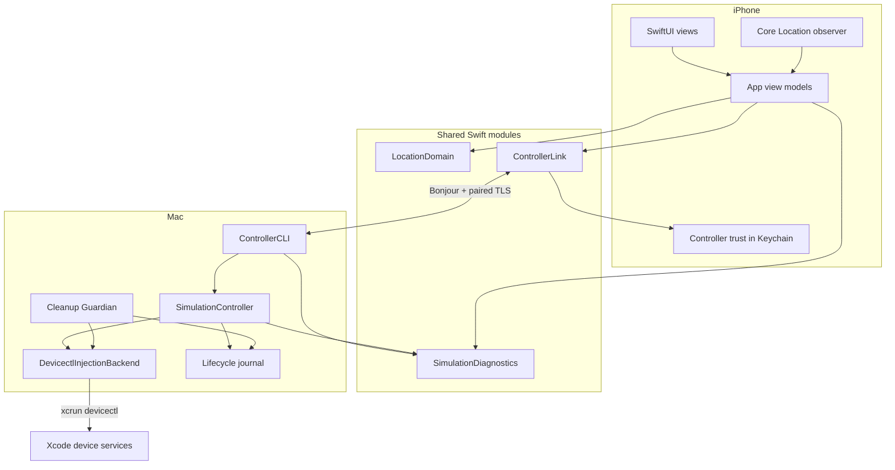
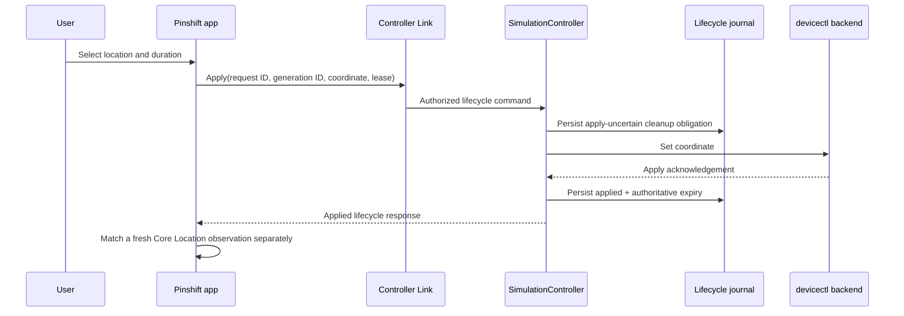

# Pinshift 代码库导览

这份文档回答三个问题：系统由哪些部分组成、一次 Apply/Stop 如何穿过这些部分，以及第一次阅读
仓库时应该按什么顺序进入。领域术语以 [CONTEXT.md](CONTEXT.md) 为准，使用和审计流程见
[GUIDE.md](GUIDE.md)。

## 一眼看懂系统



关键边界是：iOS App 负责选择、意图和观测；Mac 控制器负责权威执行；Injection Backend 负责调用
Apple 的位置测试接口；Guardian 负责在前台 server 不存在时继续兑现清理义务。

## 目录与模块

| 路径 | 职责 | 建议入口 |
| --- | --- | --- |
| `App/` | Pinshift 的 SwiftUI 界面、App 状态编排、地图搜索、位置观测、本地收藏和诊断导出 | `PinshiftApp.swift`、`ContentView.swift` |
| `Sources/LocationDomain/` | 不依赖 UI/网络的纯领域模型：坐标、选择、收藏、观测匹配、限时模拟会话 | `LocationDomain.swift`、`ManualSimulationSession.swift` |
| `Sources/ControllerLink/` | Bonjour 发现、TLS 传输、一次性配对、Keychain 信任、命令协议和 server session | `TrustedControllerLink.swift`、`ControllerCommand.swift` |
| `Sources/SimulationController/` | 模拟生命周期状态机、持久 journal、lease、heartbeat、Guardian 和 `devicectl` backend | `SimulationController.swift`、`SimulationCleanupGuardian.swift` |
| `Sources/SimulationDiagnostics/` | App/Mac 共用的结构化事件、滚动保留、脱敏和导出格式 | `SimulationDiagnostics.swift` |
| `Sources/ControllerCLI/` | CLI 命令定义、依赖装配、doctor、教程、Controller Link 到模拟控制器的适配 | `RemoteLocationControllerCommand.swift`、`ControllerCLIRuntime.swift` |
| `Sources/RemoteLocationController/` | `remote-location-controller` 可执行文件的最薄入口 | `main.swift` |
| `bin/` | 面向日常操作的 Fish 包装器：安装、启动、重置、检查、续签和诊断导出 | `_rl-common.fish`、`rl-start`、`rl-install` |
| `Support/` | launchd Cleanup Guardian 模板 | `dev.sayori.remotelocation.cleanup-guardian.plist` |
| `Tests/` | 按 Swift 模块分层的单元/集成测试，以及真机 UI/可选 smoke 测试 | `SimulationLifecycleIntegrationTests.swift`、`PinshiftUITests/` |
| `Config/`、`project.yml` | iOS target、签名、Info.plist 和 XcodeGen 配置 | `project.yml`、`Pinshift-Info.plist` |
| `docs/` | 架构决策、需求、研究、历史验证证据和开发教程 | `docs/adr/`、`docs/evidence/` |

`Package.swift` 是共享模块与 Mac CLI 的 SwiftPM 构建图；`project.yml` 是 iOS App 和 UI 测试工程的
源配置。`RemoteLocation.xcodeproj` 由 XcodeGen 生成并提交，应该跟随 `project.yml` 一起更新，而不是
把手工修改 project file 当作唯一来源。

## iOS App 怎么组织

- `PinshiftApp.swift` 创建 SwiftUI scene，并维护中英文切换。
- `ContentView.swift` 是当前主要 composition root：把连接状态、选点、收藏、限时会话、观测和诊断区块组合起来。
- `BaselineViewModel.swift` 管理 Selected Location、Saved Location、Manual Simulation Session 和观测匹配；它不直接执行网络命令。
- `ControllerLinkViewModel.swift` 管理发现、配对、连接、readiness、Apply/Extend/Stop 发送和重连后的 lifecycle reconciliation。
- `LocationPickerView.swift` 与 `LocationPickerViewModel.swift` 封装地图中心选点、搜索和微调；完成选择不会自动 Apply。
- `LocationObserver.swift` 把 Core Location callback 转成 `LocationObservation`，供 Verified Simulation 判断使用。
- `SimulationDiagnosticPipeline.swift` 在主线程按顺序预留事件，再异步写盘，保证一次 UI 操作产生的时间线顺序稳定。

这里保留了“意图”和“结果”的分离：点击 Apply 产生请求，不等于后端已应用；后端已应用也不等于
Pinshift 已收到匹配观测。UI 显式展示这几个阶段。

## Mac 控制器怎么组织

`RemoteLocationControllerCommand` 定义 `serve`、`doctor`、`apply`、`stop`、`reset`、
`cleanup-guardian` 等命令。`ControllerCLIRuntime` 是 Mac 侧 composition root，负责把配置、诊断、
`DevicectlInjectionBackend`、生命周期存储、heartbeat store 和 Guardian health store 装配起来。

`SimulationController` 是核心 actor。它串行化 Apply、Extend 和 Stop，维护 generation/request identity，
并确保 Apply 前已经落盘 Cleanup Obligation。`SimulationControllerCommandHandler` 把 Controller Link 协议
对象映射到该 actor；`ControllerCLIRunner` 为直接 CLI 操作提供同一语义。

`DevicectlInjectionBackend` 只负责安全构造并执行公开 `xcrun devicectl device simulate location`
命令。它不知道 UI、Bonjour 或收藏地点，因此可以独立测试命令边界、超时和失败映射。

## 一次 Apply 的路径



先写 `applyUncertain` 是故意的：如果后端实际设置成功、但响应在途中丢失，系统仍然保有一条必须
clear 的记录，不会因为“客户端没收到成功”而遗忘可能生效的模拟位置。

## 一次 Stop 或自动清理的路径

手动 Stop、lease 到期、server 正常退出、server-owner heartbeat 连续丢失、Guardian 重启恢复和
`rl-reset` 最终都会汇入同一个幂等 clear 路径：

1. 目标 generation 被标记为 `cleanupPending`。
2. controller 或 Guardian 调用 backend clear。
3. 只有明确成功才写入 completion 并清空 active obligation。
4. 暂时不可达时保留失败原因、retry attempt 和 next retry time。
5. App 重连后通过 lifecycle reconciliation 获取权威状态。

这也是为什么关闭 iOS App 不会直接清除位置：公开清理能力属于 Mac/Xcode 的开发者服务，不属于
iOS App；App 负责保存并重投 Stop Intent，Guardian 负责独立执行。

## 状态和权威分别属于谁

| 信息 | 权威来源 | 持久位置 |
| --- | --- | --- |
| Selected/Saved Location | Pinshift app | iOS App sandbox |
| Stop Intent / pending extension | Pinshift app | iOS App storage |
| Controller trust | iOS Keychain | 当前设备 Keychain |
| Paired App authorization | Mac controller | macOS Keychain |
| Applied/Cleanup Pending/Stopped | SimulationController journal | `~/Library/Application Support/Pinshift/SimulationLifecycle/` |
| Server liveness | foreground controller heartbeat | 同一 lifecycle 目录 |
| Guardian readiness | Cleanup Guardian health record | 同一 lifecycle 目录 |
| Backend execution result | `devicectl` exit result | journal completion + Mac diagnostics |
| Observed Location | Core Location callback | App state + iOS diagnostics |

生产 App 的 bundle identifier、Keychain account 和既有诊断 raw value 是升级兼容标识。即使代码与
界面已经统一为 Pinshift，也不能把这些值当作普通文案随意改名；否则会破坏原位升级、既有配对或
历史诊断连续性。

## 推荐阅读顺序

1. [CONTEXT.md](CONTEXT.md)：先建立 Selected、Applied、Verified、Lease 和 Cleanup Obligation 的区别。
2. `Sources/LocationDomain/ManualSimulationSession.swift`：看 iOS 侧会话状态如何表达。
3. `Sources/ControllerLink/ControllerCommand.swift`：看跨设备协议传什么，而不是猜 UI 与 Mac 如何耦合。
4. `Sources/SimulationController/SimulationLifecycleStore.swift`：看必须跨进程保存的最小状态。
5. `Sources/SimulationController/SimulationController.swift`：从 `apply`、`extendLease`、`stop` 和 reconciliation 入口读核心状态机。
6. `Sources/SimulationController/SimulationCleanupGuardian.swift`：理解 server 消失后谁继续负责清理。
7. `App/ControllerLinkViewModel.swift` 与 `App/BaselineViewModel.swift`：看 App 如何保存意图、投递请求并吸收权威结果。
8. `App/ContentView.swift`：最后再看状态如何呈现成完整界面。
9. `Tests/ControllerCLITests/SimulationLifecycleIntegrationTests.swift`：用可执行场景复核异常路径。

## 测试地图

- `LocationDomainTests`：坐标、距离、选择、收藏和本地会话状态机。
- `ControllerLinkTests`：协议关联、发现、TLS、配对、授权和 session 顺序。
- `SimulationControllerTests`：backend 命令与控制器单元行为。
- `SimulationDiagnosticsTests`：落盘、滚动保留、并发顺序和脱敏。
- `ControllerCLITests`：CLI、doctor、安装/续签脚本约束以及跨组件生命周期集成。
- `PinshiftUITests`：全屏界面、地图选点、状态反馈、重连与可选真机验证。

运行 SwiftPM 测试：

```fish
swift test
```

✅ 验证所有共享模块、Mac 控制器和脚本约束测试。

修改 `project.yml` 后重新生成 iOS 工程：

```fish
xcodegen generate --spec project.yml
```

🏗️ 从声明式配置更新已提交的 Xcode project 和共享 scheme。

构建不签名的通用 iOS 产物：

```fish
DEVELOPER_DIR=/Applications/Xcode-beta.app/Contents/Developer \
  xcodebuild -project RemoteLocation.xcodeproj \
  -scheme Pinshift \
  -destination 'generic/platform=iOS' \
  CODE_SIGNING_ALLOWED=NO build
```

🧪 验证 Pinshift App、共享源码和当前 Xcode 工程可以完整编译。

真机测试会使用当前个人环境，并可能触及签名、设备连接和 Personal Team App 配额；默认
`swift test` 不会运行显式 opt-in 的物理设备 smoke。
