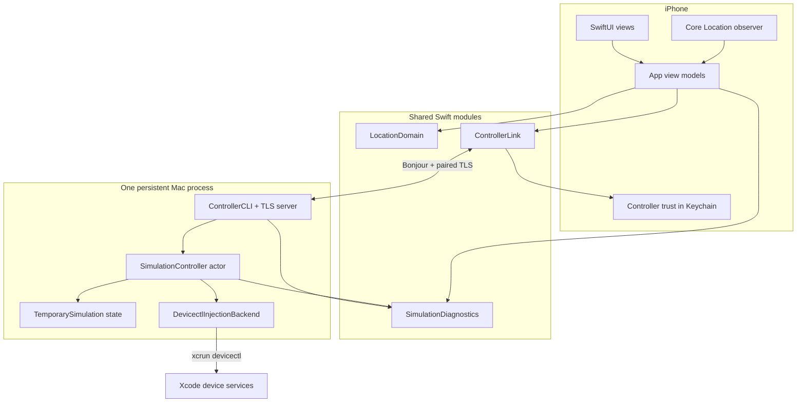

# Pinshift 代码库导览

这份文档说明系统边界、一次 Apply/Clear 的路径和推荐阅读顺序。领域术语以
[CONTEXT.md](CONTEXT.md) 为准，用户流程见 [GUIDE.md](GUIDE.md)。

## 一眼看懂系统



iOS 负责选择、短暂交互状态和观测；单一 Mac actor 负责状态权威、命令串行化和自动解除；backend
只负责调用 Apple 的位置测试接口。没有第二个 Guardian 或前台 server owner。

## 目录与模块

| 路径 | 职责 | 建议入口 |
| --- | --- | --- |
| `App/` | SwiftUI、App 状态编排、地图搜索、位置观测、收藏和诊断导出 | `ContentView.swift`、`BaselineViewModel.swift` |
| `Sources/LocationDomain/` | 坐标、选择、收藏、观测匹配和 App 侧临时会话投影 | `LocationDomain.swift`、`ManualSimulationSession.swift` |
| `Sources/ControllerLink/` | Bonjour、TLS、配对、Keychain 信任和 Status/Apply/Clear 协议 | `ControllerCommand.swift`、`TrustedControllerLink.swift` |
| `Sources/SimulationController/` | 单一 authority actor、持久 current operation、固定截止时间、重试和 `devicectl` backend | `SimulationController.swift`、`TemporarySimulationStore.swift` |
| `Sources/SimulationDiagnostics/` | 双端结构化事件、滚动保留、脱敏和导出 | `SimulationDiagnostics.swift` |
| `Sources/ControllerCLI/` | CLI、依赖装配、doctor、教程和 Link→controller 适配 | `PinshiftControllerCommand.swift`、`ControllerCLIRuntime.swift` |
| `bin/` | Fish 包装器：安装后台 authority、刷新配对码、重置、检查、续签和诊断导出 | `pinshift-install`、`pinshift-start` |
| `Support/` | 单一 launchd authority 模板 | `dev.sayori.pinshift.controller.plist` |
| `Tests/` | 分层单元/集成、脚本约束、UI 与 opt-in 真机 smoke | `TemporarySimulationAcceptanceTests.swift`、`PinshiftUITests/` |

`Package.swift` 是共享模块与 Mac CLI 的 SwiftPM 图；`project.yml` 是 iOS 工程源配置，
`Pinshift.xcodeproj` 由 XcodeGen 生成并提交。

## iOS 侧

- `ContentView` 始终提供选点；Controller Link 连接后始终提供 Apply，不用历史 backend 状态作门槛。
- `BaselineViewModel` 管理 Selected/Saved Location、Manual Simulation 投影和观测验证，不执行网络命令。
- `ControllerLinkViewModel` 管理发现、配对、Status/Apply/Clear 和重连后的 snapshot 替换。
- `ManualSimulationSession` 只保存 selection。Apply/Clear 在进程内相关联；旧响应不能覆盖新操作。
- `LocationPickerView` 的选择 callback 没有“被生命周期拒绝”的分支。

Applied 与 Verified 故意分离：后端确认设置成功不等于 Pinshift 已收到新观测，也不保证其他 App 的传播。

## Mac 侧

`dev.sayori.pinshift.controller` LaunchAgent 运行 `pinshift-controller link serve`。同一进程创建一个
`SimulationController`，并把它同时交给 TLS session 和后台 reconcile loop。

`SimulationController` 是深模块边界：

- 一个 FIFO gate 覆盖持久化、readiness、backend Apply/Clear 和 reconcile；
- 新 Apply 只检查当前执行条件，不检查历史 simulation phase；
- backend 调用前先持久化 operation ID、坐标和 `acceptedAt + 900s`；
- 同一 request ID 的重试返回原 deadline，真正的新 Apply 原子替换 current；
- Clear 带目标 operation ID，过期 Clear 成功 no-op；
- 到期失败保留 capped backoff，但任何新 Apply 都能替换该状态；
- schema 1 Mac state 在升级时变成立即到期的 clear，随后原地写为 schema 2。

`DevicectlInjectionBackend` 不知道 UI、网络或计时，只安全构造公开 `xcrun devicectl device simulate location`
命令并映射结果。

## Apply 路径

```mermaid
sequenceDiagram
  participant U as User
  participant A as Pinshift app
  participant L as Controller Link
  participant C as SimulationController
  participant S as State store
  participant D as devicectl

  U->>A: Choose any location and tap Apply
  A->>L: Apply(request ID, coordinate)
  L->>C: Authorized command
  C->>S: Replace current; persist fixed deadline
  C->>D: Set coordinate
  D-->>C: Applied or failed
  C-->>A: Original deadline or explicit failure
  A->>A: Verify fresh observation separately
```

即使 backend 调用后进程崩溃，预先落盘的 armed record 仍会在原 deadline 触发 clear。失败状态不是下一次
Apply 的前置条件。

## Clear 和自动解除路径

Clear Now 记录“用户点击时看到的 operation”。如果新 Apply 已经替换 current，旧 Clear 在 Mac 直接
成功 no-op。自动 timer 与 Apply 也通过同一个 gate：旧 clear 已开始时，新 Apply 排队并最终胜出；新
Apply 先进入时，reconcile 只会看到新 deadline。

到期流程：标记 `clearPending` → 调用 backend → 成功清空 `current`；失败则保存 retry attempt、下一次
时间和原因。Mac 或设备不可达是执行边界，不是 UI 锁。

## 权威与持久化

| 信息 | 权威来源 | 持久位置 |
| --- | --- | --- |
| Selected/Saved Location | Pinshift app | iOS App sandbox |
| Controller trust | iOS Keychain | 当前设备 Keychain |
| Paired App authorization | Mac controller | macOS Keychain |
| Current operation/deadline/retry | SimulationController | `~/Library/Application Support/Pinshift/SimulationLifecycle/lifecycle.json` |
| Backend result | `devicectl` exit | current state + Mac diagnostics |
| Observed Location | Core Location callback | App state + iOS diagnostics |

App 重连或重启后用 Mac snapshot 替换显示状态。iOS 不持久化待重投的 Clear、时长延长或清理确认。

## 推荐阅读顺序

1. [CONTEXT.md](CONTEXT.md)：建立 Temporary Simulation、Automatic Clear 和 Clear Now 的区别。
2. `Sources/LocationDomain/ManualSimulationSession.swift`：看 App 投影如何忽略旧响应。
3. `Sources/ControllerLink/ControllerCommand.swift`：看跨设备协议的最小表面。
4. `Sources/SimulationController/TemporarySimulationStore.swift`：看最小持久状态和迁移。
5. `Sources/SimulationController/SimulationController.swift`：读 Apply、Clear、reconcile 和 gate。
6. `App/ControllerLinkViewModel.swift` 与 `App/BaselineViewModel.swift`：看 UI 如何投递并吸收 Mac 状态。
7. `Tests/SimulationControllerTests/SimulationControllerTests.swift`：复核替换、重试、重启和竞态。
8. `Tests/ControllerCLITests/TemporarySimulationAcceptanceTests.swift`：复核 App→Link→Mac 的完整协议。

## 验证

```fish
swift test
```

✅ 验证共享模块、Mac authority、迁移和脚本约束。

```fish
DEVELOPER_DIR=/Applications/Xcode-beta.app/Contents/Developer \
  xcodebuild -project Pinshift.xcodeproj \
  -scheme Pinshift \
  -sdk iphonesimulator \
  CODE_SIGNING_ALLOWED=NO build
```

🧪 验证 iOS App、共享源码和本地化资源完整编译。

真机测试会使用个人签名和物理设备，默认 `swift test` 不运行显式 opt-in smoke。
