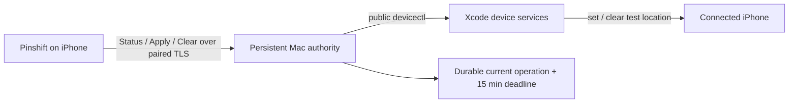

<p align="center">
  
</p>

<h1 align="center">Pinshift</h1>

<p align="center">
  在自己的 iPhone 上应用临时测试地点；即使不再操作，也会自动解除。
</p>

Pinshift 是一套由 iPhone App 和一个可信 Mac 控制器组成的个人开发工具。它通过 Xcode 的公开
`devicectl` 工作流设置测试位置。用户只需要选点并 Apply：每个地点固定生效 15 分钟，新 Apply 随时
替换旧地点，历史状态永远不会锁住选点或 Apply。

当前正式版本为 **1.0.1**。

## 核心能力

- **直观选点**：地图中心选点、地点搜索、经纬度输入、收藏地点和近距离微调。
- **固定临时**：每次 Apply 固定 15 分钟，无时长选择和无限模式；新 Apply 立即替换并重新计时。
- **永不阻塞**：活动中、立即解除失败、重连或迁移后，都可以继续选择并应用新地点。
- **后台权威**：一个 macOS LaunchAgent 同时负责 Controller Link、当前状态和到期自动解除，不要求终端常驻。
- **可信连接**：iPhone 与 Mac 通过 Bonjour、TLS 和一次性六位码配对，不需要账号或云服务。
- **如实反馈**：区分后端已应用、App 已观测、立即解除未确认和 Mac 权威状态，不用界面猜测替代事实。

## 工作方式



Mac 是模拟状态的唯一权威。Apply 在调用后端前写入当前 operation 和固定截止时间；同一请求重试不会
延长截止时间，新的 Apply 会替换它。Clear Now 只是便利操作，延迟到达时也只能清除它原本看到的
operation，不能误清更新的地点。

到期时如果 Mac 或 iPhone 不可达，公开接口无法凭空完成 clear；Mac 会保留责任，并在设备首次恢复
可达时重试。与此同时，用户的新 Apply 仍然可用。

## 快速开始

首次安装：

```fish
direnv allow
pinshift-install
pinshift-doctor
```

🛠️ 安装稳定签名控制器与单一后台 authority，并检查当前环境。

只有新设备需要配对码时才运行：

```fish
pinshift-start
```

🔗 刷新后台 Controller Link 并打印六位配对码；命令随后立即返回。

完整操作、恢复路径和审计方法见 [GUIDE.md](GUIDE.md)。

## 项目边界

Pinshift 当前针对一台开发者自有 Mac、一个已配对的 iPhone 和仓库指定的 Xcode 环境。它不是云端
定位服务，也不绕过 iOS 或第三方 App 对模拟位置的限制；当前只支持静态坐标，不包含路线播放。

## 文档

| 文档 | 面向谁 | 内容 |
| --- | --- | --- |
| [使用与审计指南](GUIDE.md) | 日常使用者 | 安装、配对、选点、替换、解除与状态审计 |
| [代码库导览](CODEBASE.md) | 维护者 | 模块职责、关键数据流和推荐阅读顺序 |
| [开发环境教程](docs/tutorial.md) | 开发者 | Xcode、direnv、签名与 Controller Link 配置 |
| [领域词汇](CONTEXT.md) | 设计与开发 | 项目的统一概念和边界 |
| [架构决策](docs/adr/) | 维护者 | 关键技术取舍及其原因 |
| [验证证据](docs/evidence/) | 审计者 | 真机、构建和历史行为记录 |

## 技术栈

Swift 6、SwiftUI、MapKit、Core Location、Network.framework、Security/Keychain、Swift Package
Manager、XcodeGen，以及 Xcode 27 的公开 `devicectl` 位置模拟接口。

## License

Pinshift 使用 [MIT License](LICENSE)。
