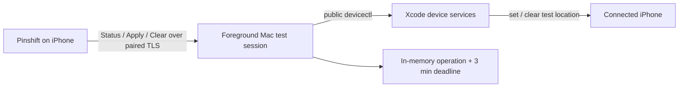

<p align="center">
  
</p>

<h1 align="center">Pinshift</h1>

<p align="center">
  在自己的 iPhone 上应用临时测试地点；即使不再操作，也会自动解除。
</p>

Pinshift 是一套由 iPhone App 和一个可信 Mac 控制器组成的个人开发工具。它通过 Xcode 的公开
`devicectl` 工作流设置测试位置。用户只需要选点并 Apply：每个地点固定生效 3 分钟，新 Apply 随时
替换旧地点，历史状态永远不会锁住选点或 Apply。

生产注入统一使用 devicectl，并通过 Apply 后的观测验证结果。
收藏只接受版本 2 的 WGS84 数据，选点只接受版本 3；旧格式会报错，不自动转换或清空。

当前正式版本为 **1.1.0**（build 5），见 [GitHub Release](https://github.com/sayoriqwq/pinshift/releases/tag/v1.1.0)。

## 核心能力

- **直观选点**：地图中心选点、地点搜索、经纬度输入、收藏地点和近距离微调。
- **固定临时**：每次 Apply 固定 3 分钟，无时长选择和无限模式；新 Apply 立即替换并重新计时。
- **永不阻塞**：活动中、立即解除失败、重连后，都可以继续选择并应用新地点。
- **手机准备**：通过独立 iPhone 快捷指令按需续签 App，并启动或复用 Mac 前台控制器。
- **按需前台**：只在测试时显式启动 Mac 控制器；正常退出先确认真实 Clear，失败则保留前台等待；不注册常驻服务。
- **可信连接**：iPhone 与 Mac 通过 Bonjour、TLS 和一次性六位码配对，不需要账号或云服务。
- **如实反馈**：区分后端已应用、App 已观测、立即解除未确认和 Mac 权威状态，不用界面猜测替代事实。

## 工作方式



运行中的 Mac 测试会话是模拟状态的唯一权威。同一请求重试不会延长截止时间，新的 Apply 会替换它。
Clear Now 始终显示，即使当前没有活动记录；每次点击都真实调用后端，只有 `devicectl` 确认后才显示成功。

到期或正常退出时，控制器执行真实 clear；失败会如实显示，并在当前前台会话中有界退避重试。
恢复可达后自动补清理，也可从 App 再试立即解除。进程消失期间没有后台接管者；下次显式启动先尝试
清理遗留模拟，失败不会锁住新 Apply。

## 快速开始

**第一次使用请从 [首次使用与配置](docs/getting-started.md) 开始。** 教程按依赖顺序覆盖工具环境、[Apple 账号与签名](docs/apple-signing.md)、首次真机安装、Mac 控制器和配对；无需维护者的全局命令或 Home Manager 配置。

当前教程使用 Apple Silicon Mac、Nix 提供的工具环境和完整 Xcode 27。固定 App 标识仍是其他 Apple 账号可能遇到的签名限制，详见签名教程。完成首次配置后，在已进入工具环境的仓库终端运行：

```fish
pinshift
```

🔗 按需检查并续签 App，再启动前台会话；保持终端打开，Ctrl-C 等待真实解除成功后退出。

需要在任意目录启动时，可按 [本机注册教程](docs/getting-started.md#可选注册到本机从任意目录启动) 使用 `pinshift register`；也可以只在项目环境中使用。

希望从手机启动时，按 [iPhone 快捷指令配置](docs/iphone-shortcut.md) 添加「准备使用 Pinshift」主屏幕按钮；需先完成一次本机设置和独立 SSH 密钥授权。

日常操作、更新与故障恢复见 [GUIDE.md](GUIDE.md)，地图适配范围见 [坐标边界](CODEBASE.md#坐标边界)。

## 项目边界

Pinshift 当前针对一台开发者自有 Mac、一个已配对的 iPhone 和仓库指定的 Xcode 环境。它不是云端
定位服务，也不绕过 iOS 或第三方 App 对模拟位置的限制；当前只支持静态坐标，不包含路线播放。

## 文档

| 文档 | 面向谁 | 内容 |
| --- | --- | --- |
| [首次使用与配置](docs/getting-started.md) | 新用户 | 从克隆到首次运行的完整步骤 |
| [Apple 账号与签名](docs/apple-signing.md) | 首次安装或签名排障 | Team、真机安装、控制器签名与续签 |
| [iPhone 快捷指令配置](docs/iphone-shortcut.md) | 希望从手机启动的用户 | 远程登录、公钥授权、主屏幕按钮和故障恢复 |
| [使用与审计指南](GUIDE.md) | 日常使用者 | 安装、配对、选点、替换、解除与状态审计 |
| [代码库导览](CODEBASE.md) | 维护者 | 模块职责、关键数据流和推荐阅读顺序 |
| [领域词汇](CONTEXT.md) | 设计与开发 | 项目的统一概念和边界 |
| [架构决策](docs/adr/) | 维护者 | 关键技术取舍及其原因 |

## 技术栈

Swift 6、SwiftUI、MapKit、Core Location、Network.framework、Security/Keychain、Swift Package
Manager、XcodeGen，以及 Xcode 27 的公开 `devicectl` 位置模拟接口。

## License

Pinshift 使用 [MIT License](LICENSE)。
