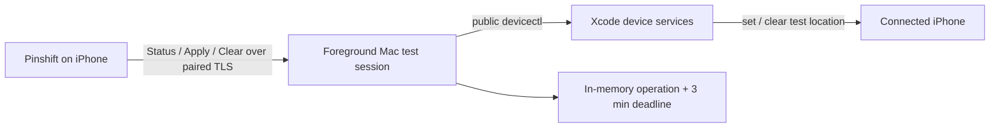

<p align="center">
  
</p>

<h1 align="center">Pinshift</h1>

<p align="center">
  在自己的 iPhone 上应用临时测试地点；即使不再操作，也会自动解除。
</p>

Pinshift 是一套由 iPhone App 和一个可信 Mac 控制器组成的个人开发工具。它通过 Xcode 的公开
`devicectl` 工作流设置测试位置。用户只需要选点并 Apply：每个地点固定生效 3 分钟，新 Apply 随时
替换旧地点，历史状态永远不会锁住选点或 Apply。

当前正式版本为 **1.0.1**。

## 核心能力

- **直观选点**：地图中心选点、地点搜索、经纬度输入、收藏地点和近距离微调。
- **固定临时**：每次 Apply 固定 3 分钟，无时长选择和无限模式；新 Apply 立即替换并重新计时。
- **永不阻塞**：活动中、立即解除失败、重连或迁移后，都可以继续选择并应用新地点。
- **按需前台**：只在测试时手动启动 Mac 控制器；正常退出先确认真实 Clear，失败则保留前台等待；不注册常驻服务。
- **可信连接**：iPhone 与 Mac 通过 Bonjour、TLS 和一次性六位码配对，不需要账号或云服务。
- **如实反馈**：区分后端已应用、App 已观测、立即解除未确认和 Mac 权威状态，不用界面猜测替代事实。

## 工作方式



运行中的 Mac 测试会话是模拟状态的唯一权威。同一请求重试不会延长截止时间，新的 Apply 会替换它。
Clear Now 始终显示，即使当前没有活动记录；每次点击都真实调用后端，只有 `devicectl` 确认后才显示成功。

到期或正常退出时，控制器执行真实 clear；失败会如实显示，并在当前前台会话中有界退避重试。
恢复可达后自动补清理，也可从 App 再试立即解除。进程消失期间没有后台接管者；下次显式启动先尝试
清理遗留模拟，失败不会锁住新 Apply。

## 快速开始

首次进入仓库并安装：

```fish
direnv allow
pinshift setup
pinshift doctor
```

🛠️ 安装稳定签名控制器、移除旧常驻项，并检查当前环境。

每次开始测试时运行，并保持终端打开：

```fish
pinshift
```

🔗 按需检查并续签 App，再启动前台 Controller Link；Ctrl-C 先解除，确认成功后退出。

需要立即解除模拟时运行 `pinshift clear`；成功回执不等于其他 App 已刷新物理位置。`pinshift help` 会列出完整的日常入口。此工作站通过
Home Manager 安装全局入口后，在仓库外也可以使用同一条命令；项目依赖和签名产物仍留在仓库内。

完整操作、恢复路径和审计方法见 [GUIDE.md](GUIDE.md)。本轮真机连接、精度、生命周期和逐 App 传播
尚待本人验收，步骤见 [#24 验收清单](docs/evidence/spec-24-owner-acceptance.md)。

## 项目边界

Pinshift 当前针对一台开发者自有 Mac、一个已配对的 iPhone 和仓库指定的 Xcode 环境。它不是云端
定位服务，也不绕过 iOS 或第三方 App 对模拟位置的限制；当前只支持静态坐标，不包含路线播放。

## 文档

| 文档 | 面向谁 | 内容 |
| --- | --- | --- |
| [使用与审计指南](GUIDE.md) | 日常使用者 | 安装、配对、选点、替换、解除与状态审计 |
| [代码库导览](CODEBASE.md) | 维护者 | 模块职责、关键数据流和推荐阅读顺序 |
| [开发环境教程](docs/tutorial.md) | 开发者 | Xcode、direnv、签名与 Controller Link 配置 |
| [领域词汇](CONTEXT.md) | 设计与开发 | 项目的统一概念和边界 |
| [架构决策](docs/adr/) | 维护者 | 关键技术取舍及其原因 |
| [验证证据](docs/evidence/) | 审计者 | 真机、构建和历史行为记录 |

## 技术栈

Swift 6、SwiftUI、MapKit、Core Location、Network.framework、Security/Keychain、Swift Package
Manager、XcodeGen，以及 Xcode 27 的公开 `devicectl` 位置模拟接口。

## License

Pinshift 使用 [MIT License](LICENSE)。
