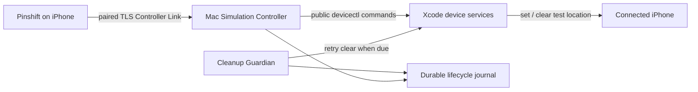

<p align="center">
  
</p>

<h1 align="center">Pinshift</h1>

<p align="center">
  在自己的 iPhone 上安全、可追踪地运行限时静态位置模拟。
</p>

Pinshift 是一套由 iPhone App、可信 Mac 控制器和独立清理守护进程组成的个人开发工具。它通过
Xcode 的公开 `devicectl` 工作流设置测试位置，并把“最终一定尝试恢复正常定位”作为会话生命周期
的一部分，而不是依赖用户记得再次点击 Stop。

当前正式版本为 **1.0.1**。

## 核心能力

- **直观选点**：地图中心选点、地点搜索、经纬度输入、收藏地点和近距离微调。
- **限时会话**：每次模拟明确选择 15、30 或 60 分钟，默认 15 分钟；会话中可延长 15 分钟。
- **独立清理**：macOS Cleanup Guardian 不依赖前台 `pinshift-start` 进程，在租约到期、服务正常退出或心跳丢失后执行清理。
- **可信连接**：iPhone 与 Mac 通过 Bonjour、TLS 和一次性六位码配对，不需要账号或云服务。
- **如实反馈**：区分已选择、后端已应用、Pinshift 已观测、等待清理和后端已确认清除，不用“看起来成功”代替真实状态。
- **本地诊断**：App 与 Mac 分别保留经过脱敏、容量受限的事件记录，便于复盘 Apply、Stop、重连和自动清理。

## 工作方式



每次 Apply 都先在 Mac 上写入持久清理义务，再调用位置后端。最终清理以
`devicectl device simulate location clear` 成功返回为准；App 自己的 Core Location 观测只用于验证
Pinshift 看到了什么，不被当作系统状态的权威来源。

## 快速开始

完成首次安装与配对后，日常只需要：

```fish
cd pinshift
pinshift-start
```

🚀 启动可信 Mac 控制器，随后在 iPhone 上打开 Pinshift。

完整操作、恢复路径和审计方法见 [GUIDE.md](GUIDE.md)。

## 项目边界

Pinshift 当前针对一台开发者自有 Mac、一个已配对的 iPhone 和仓库指定的 Xcode 环境。它不是云端
定位服务，也不绕过 iOS 或第三方 App 对模拟位置的限制；当前只支持静态坐标，不包含路线播放。

自动清理可以跨前台 server 退出和 Mac 登录会话恢复，但不能突破物理可达性：如果 Mac 关机或目标
iPhone 离线，清理义务会持久保留，并在同一台 Mac 与 iPhone 再次可达、解锁后继续重试。

## 文档

| 文档 | 面向谁 | 内容 |
| --- | --- | --- |
| [使用与审计指南](GUIDE.md) | 日常使用者 | 启动、选点、结束、恢复、签名续期与状态审计 |
| [代码库导览](CODEBASE.md) | 维护者 | 模块职责、关键数据流、状态权威和推荐阅读顺序 |
| [开发环境教程](docs/tutorial.md) | 开发者 | Xcode、direnv、签名与 Controller Link 的技术配置 |
| [领域词汇](CONTEXT.md) | 设计与开发 | 项目的统一概念和边界 |
| [架构决策](docs/adr/) | 维护者 | 关键技术取舍及其原因 |
| [验证证据](docs/evidence/) | 审计者 | 真机、构建和清理行为的历史验证记录 |

## 技术栈

Swift 6、SwiftUI、MapKit、Core Location、Network.framework、Security/Keychain、Swift Package
Manager、XcodeGen，以及 Xcode 27 的公开 `devicectl` 位置模拟接口。

## License

Pinshift 使用 [MIT License](LICENSE)。
